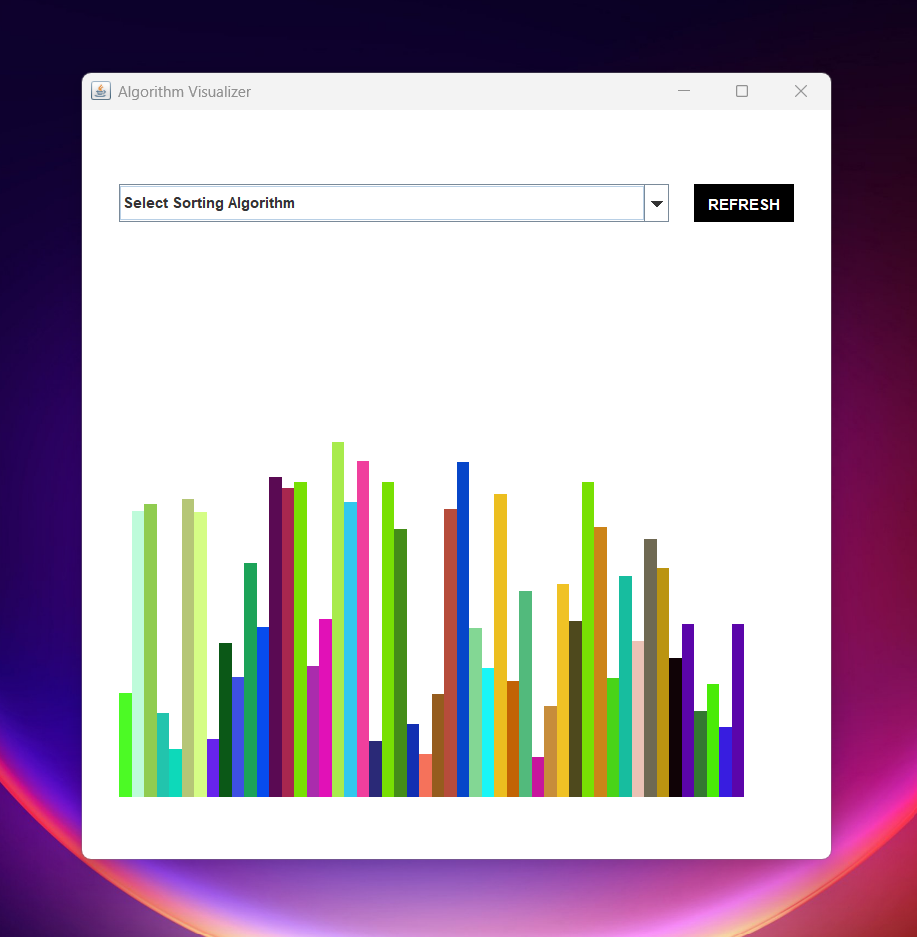

# Algorithm Visualizer

Algorithm Visualizer is a Java Swing application that provides visual representations of various algorithms. It helps users understand how algorithms work step-by-step through interactive and animated visualizations.

## Features

- Visualize different sorting algorithms
  - Bubble Sort
  - Quick Sort
  - Merge Sort
- Step-by-step execution with animations
- User-friendly interface

## Prerequisites

- Java Development Kit (JDK) 8 or higher

## Installation

1. **Clone the repository:**

   ```bash
   git clone https://github.com/yourusername/algorithm-visualizer.git

   cd algorithm-visualizer
   ```

2. **Compile and run the application:**

   ```bash
   javac AlgorithmVisualiser.java

   java AlgorithmVisualiser
   ```

## Usage

- Launch the application by running the `Main` class.
- Select an algorithm from the dropdown menu.
- Refresh the Visuals by refresh button

## Contributing

Contributions are welcome! Here are a few ways you can contribute:

- Report bugs and suggest features
- Submit pull requests with improvements and bug fixes
- Create new algorithm visualizations

## License

This project is licensed under the MIT License - see the [LICENSE](LICENSE) file for details.

## Acknowledgements

- [Java Swing Documentation](https://docs.oracle.com/javase/tutorial/uiswing/)
- [MySQL Connector/J Documentation](https://dev.mysql.com/doc/connector-j/8.0/en/)

## Contact

For any questions or suggestions, feel free to reach out:

---

Happy visualizing!
